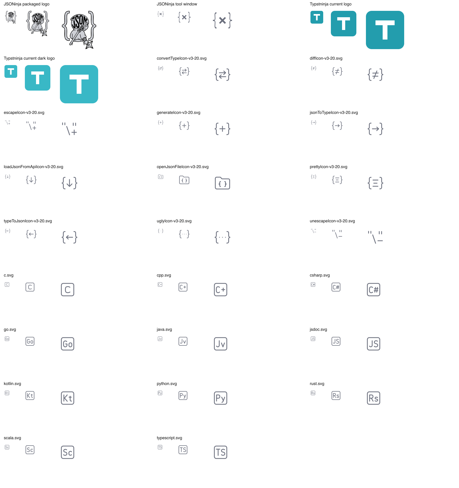

# 자산의 역할과 원본

같은 제품을 나타내더라도 로고는 식별, IDE 아이콘은 작은 기능 구분, 상점 화면 이미지는 사용 경험의 증거를 담당한다. 각 자산은 [공통 시각 언어](visual-language.md)를 공유하고 자기 역할에 맞게 단순화한다.

## 자산 목록

| 자산 | 사용할 원본·연결 | 상태와 적용 방법 |
| --- | --- | --- |
| 선택한 제품 심볼 | [typstninja-logo.png](logo/typstninja-logo.png) | 사용자 선택: 02번 ‘모여 있는 눈’. 1254×1254 투명 PNG이며 후속 제작의 시각 기준이다. |
| 현재 패키지 로고 | [pluginIcon.svg](../../../src/main/resources/META-INF/pluginIcon.svg), [pluginIcon_dark.svg](../../../src/main/resources/META-INF/pluginIcon_dark.svg) | 기존 채움형 T. 선택한 로고의 SVG·테마별 파생본은 아직 이 경로에 적용하지 않았다. |
| 글자형 제품명·워드마크 | [plugin.xml](../../../src/main/resources/META-INF/plugin.xml)의 `Typstninja` | 기본 UI 계열의 산세리프 굵은 제품명. 최종 벡터 원본과 실제 서체·배치 기록은 제작 시 남긴다. |
| IDE 파일·기능 아이콘 | [아이콘 문서](../components/icons.md) | 선·테마 기준과 코드 소비자는 해당 문서에서 관리한다. |
| 제품 화면 이미지 | [스크린샷 후보](screenshots-and-previews.md) | 실제 실행 화면을 확보한 후 원본 경로와 버전을 연결한다. 현재 승인된 캡처 파일은 없다. |
| 상점 소개 이미지 | [구성과 문구](composition-and-copy.md) | 선택한 로고와 실제 제품 캡처로 제작한다. 게시용 이미지 원본은 아직 없다. |

공식 제출 자산명·규격과 이 역할들의 대응은 [상점별 문서](stores/jetbrains-marketplace.md)에 있다. 새 파일명을 이미 존재하는 자산처럼 적지 않는다.

## 확정한 로고 원본

2026-09-26 사용자는 생성 이미지 `exec-ebdf6dca-7b09-45e0-a14b-9a9530a300f5`를 선택했다. 선택한 이미지는 위 제품 심볼 경로에 바이트 변경 없이 보관했다. 크기·투명도·SHA-256과 선택 근거는 [선택 기록](logo/selection.json)에 있다.

중앙에 가까이 모인 검은 점눈, 긴 T의 세로획, 하단 두 곡선, 청록색 두건이 식별 기준이다. 표정·세부 요소의 규칙은 [시각 언어](visual-language.md)를 따른다. 후속 자산은 선택한 원본을 기준으로 사용하며 다른 시안을 기준 로고로 혼용하지 않는다.

## 기존 로고의 구조와 적용 경계

기본·어두운 로고 모두 원본 좌표계가 `0 0 40 40`이다. 배경 사각형은 `(0, 0)`부터 `(40, 40)`까지, 모서리 값은 `rx="6"`이다. T 경로는 `x=10…30`, `y=10…30` 범위에 있다. 두 파일은 배경 색만 다르다.

이 수치는 **기존 원본의 관측값**이다. 이미지에 제품 화면이나 제목을 배치하는 템플릿 영역이 아니며, 여백의 납품 기준도 아니다. 현재 배경 도형은 원본 끝까지 차 있으므로, 새 로고에서는 [상점의 투명 여백 권고](stores/jetbrains-marketplace.md)를 별도로 적용한다.

시안을 만들 때는 T의 식별과 [색의 역할](visual-language.md)을 유지하면서 두건·눈매를 통합한다. 최종 외곽·시각적 무게·여백은 로고 사용 크기에 맞춰 조정한다. 원본의 전체 배경 사각형이나 흰색 채움을 필수 형상으로 복제하지 않는다. 부위별 구성과 JSONinja와의 비교 기준은 [시각 언어](visual-language.md)가 소유한다.

## 크기와 배치의 관계

로고는 비율을 유지해 배치하며 잘라내거나 가로세로를 따로 늘리지 않는다. 작은 IDE 아이콘과 로고는 각각의 사용 크기에서 다듬는다. 로고에 맞춘 선 굵기를 IDE 기호의 기준으로 역수입하지 않는다.

공통 상점 이미지 템플릿이 생기면 이 문서에 원본 좌표계, 제품 화면 영역, 제목 영역, 허용 변형을 기록한다. 아직 확인한 배치 템플릿이 없으므로 고정 격자나 비율을 기존 규칙인 것처럼 제시하지 않는다.

## 분석 원본과 채택 범위

| 원본 | 출처 | 이어받는 표현 | 가져오지 않는 부분 |
| --- | --- | --- | --- |
| v3 기능 기호 | [expui/v3](/Users/buyong/workspace/private/json-helper2/src/main/resources/icons/expui/v3) | 선·테마 쌍, 반대 동작의 대칭 관계 | JSON을 뜻하는 중괄호의 의미 |
| v3 언어 틀 | [typescript.svg](/Users/buyong/workspace/private/json-helper2/src/main/resources/icons/languages/v3/typescript.svg) 등 11종 | 같은 사각 틀에 언어 식별자를 넣는 구조 | `TS`, `Kt` 등 다른 언어의 식별자 |
| JSONinja 패키지 로고 | [META-INF/pluginIcon.svg](/Users/buyong/workspace/private/json-helper2/src/main/resources/META-INF/pluginIcon.svg) | 두건·눈매, 윤곽과 평면 채움, 글자와 닌자 형태의 결합 | JSON 글자·중괄호·무기·복잡한 소품을 그대로 복제하는 것 |
| 온보딩 동작 자료 | [images/onboarding](/Users/buyong/workspace/private/json-helper2/src/main/resources/images/onboarding) | 실제 화면에서 동작과 결과를 보여주는 방식 | JSON 데이터·옛 아이콘을 Typst 화면에 합성하는 것 |
| 과거 아이콘 기획 PNG | [jsoninja.png](/Users/buyong/workspace/private/json-helper2/ai/png/jsoninja.png), [type_converter.png](/Users/buyong/workspace/private/json-helper2/ai/png/type_converter.png) | 기능을 나란히 비교하는 설명 방식 | 2px 선과 과거 회색·강조색을 v3 규칙으로 채택하는 것 |

## 원본에서 적용까지의 영역 지도

| 원본의 좌표·크기 | 확인한 영역의 역할 | 허용되는 적용 |
| --- | --- | --- |
| v3 언어 틀의 16 좌표계 | 사각 틀과 내부 언어 식별자를 분리한 구조 | 외곽을 보존하고 내부 T를 정리한다. 좌표·모서리·획의 기준은 [공통 값](../tokens.md)을 따른다. |
| 기존 Typst 로고의 40 좌표계 | 배경 전체와 중앙의 채움형 T | 색·T의 식별만 이어받는다. 전체 배경이 새 로고의 안전 영역이라는 뜻은 아니다. |
| JSONinja 온보딩 GIF 800×571 | 편집기·도구 모음·동작 결과를 담은 실제 화면 | 비율을 보존해서 보여준다. 이 치수는 상점 납품 규격이 아니다. |
| 온보딩의 `heroImagePanel` 선호 크기 498×332 | 이미지를 표시하는 뷰포트. 실제 렌더링에는 현재 컴포넌트 크기를 사용 | 가로·세로 비율 중 작은 축척을 사용해 안에 맞추고 중앙 정렬한다. 화면을 늘이거나 자르지 않는다. |
| 공개 상점 캡처 | 작업 화면과 검은 설명 영역이 함께 존재 | 스타일 참고용 평면 이미지다. 편집 가능한 캡션 슬롯이나 원본 템플릿은 확인되지 않았다. |

뷰포트의 맞춤 방식은 [온보딩 렌더링 코드](/Users/buyong/workspace/private/json-helper2/src/main/kotlin/com/livteam/jsoninja/ui/onboarding/OnboardingTutorialDialogView.kt)에 근거한다. 상점 캡처의 실제 치수와 조회한 자산은 [상점 문서](stores/jetbrains-marketplace.md)에서 관리한다.

새 Typst 소개 이미지에서 제품 화면과 캡션은 분리 가능한 편집 요소로 유지한다. 화면 영역은 실제 캡처, 캡션 영역은 설명, 제품 식별 영역은 T·제품명만 담당한다. 검은 띠가 보인다는 이유로 그 아래 제품 화면을 삭제 가능한 영역으로 간주하지 않는다.

## 분석용 비교판

다음은 기존 원본을 렌더링하거나 GIF 프레임을 추출한 문서 삽화다. 새 로고·상점 이미지를 제작한 결과나 승인 시안이 아니다.

[어두운 배경 비교](../references/jsoninja-reference-dark.png)에서는 동일 기호의 테마 변형을 확인할 수 있다. [온보딩 대표 프레임](../references/jsoninja-onboarding-reference.png)은 탭·기능 도구 모음·비교 창의 실제 구성을 보여준다. 비교판의 글꼴·배경·칸 간격은 분석을 위한 배치이며 브랜드 규칙으로 채택하지 않는다.
