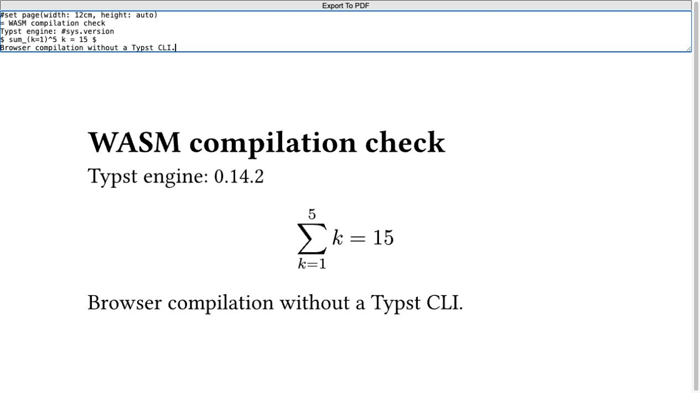

# Typst WebAssembly 적용 가능성 조사

> 이 문서는 WASM 전환 전의 조사 기록이다. 현재 구현은 JVM의 Chicory WASM 호스트로 전환했으며, 최신 API·제약·배포 방법은 [Typst WASM Wiki 원본](../wiki/Typst-WASM.md)을 따른다. 아래 네이티브 소스 참조는 조사 당시 커밋을 가리킨다.


확인일: 2026-09-27. 대상: Typstninja의 예정 출시 버전 `0.2.0`.

**Typst 컴파일러를 WebAssembly로 실행하는 것은 가능하다.** 공개 구현의 브라우저 예제에서 소스를 직접 바꾸고 제목·본문·수식의 SVG 재생성을 확인했다. 다만 이 결과는 Typstninja의 현재 기능 전체가 WASM으로 전환되었다는 뜻이 아니다. 현재 런타임과 예제의 Typst 버전이 다르고, 파일·폰트·패키지·내보내기·위치 이동을 연결할 작업이 남는다.

이 문서는 코드와 공개 구현을 대조한 조사 결과다. WASM 전환을 구현하거나 신규 라이브러리를 제품에 추가하지 않았다. 이번 제품 변경은 출시 버전과 로고에 한정한다.

## 1. 실제로 확인한 것

[typst.ts의 브라우저 예제](https://myriad-dreamin.github.io/typst.ts/preview.html)를 열어 다음 내용을 입력했다.

```typst
#set page(width: 12cm, height: auto)
= WASM compilation check
Typst engine: #sys.version
$ sum_(k=1)^5 k = 15 $
Browser compilation without a Typst CLI.
```

제목·수식·본문이 입력 내용대로 렌더링됐고, `sys.version`은 **0.14.2**로 표시됐다. 페이지의 스크립트는 `$typst.svg()`를 호출하며 별도의 웹 컴파일러와 렌더러 WASM을 CDN에서 로드한다. 기존 PDF나 이미지 하나를 보여주는 예제가 아니라 입력에 따라 다시 컴파일하는 것을 확인했다.



| 확인 항목 | 결과 | 이 결과의 범위 |
| --- | --- | --- |
| 브라우저 소스 편집 → SVG | 확인 | 위 짧은 영어·수식 문서와 공개 예제 |
| 실제 엔진 버전 출력 | `0.14.2` | 예제에서 로드한 배포물. 최신 개발 소스의 버전을 뜻하지 않음 |
| PDF 내보내기 | API 구현 확인, 파일 결과 미확인 | 예제의 버튼은 PDF Blob을 새 창으로 여는 방식. 자동화에서 다운로드 파일을 확보하지 못했으므로 PDF 성공으로 판정하지 않음 |
| Typstninja의 JCEF 내부 실행 | 미수행 | 일반 브라우저에서의 성공을 IDE 내부 성공으로 확대하지 않음 |
| 현재 런타임의 WASM 빌드 | 미수행 | 현재 `renderer`를 WASM 대상으로 컴파일하지 않음 |
| 성능·메모리·배포 크기 | 미측정 | 네이티브보다 빠르거나 작다고 단정할 수 없음 |

셸에서 npm 배포 메타데이터를 조회하는 시도는 DNS 오류로 실패했다. 해당 경로로 패키지를 설치하지 않았으며 공개 문서·소스와 브라우저 실행을 근거로 판단했다.

## 2. 현재 프로젝트의 CLI 의존 위치

현재 구현은 Kotlin 언어 지원, 자체 Rust 런타임, Typst CLI를 함께 사용한다.

| 기능 | 현재 구현 | WASM 전환 시 의미 |
| --- | --- | --- |
| 구문 강조·PSI·보수적 완성·탐색 | Kotlin 언어 서비스 | 컴파일러 교체와 독립적으로 유지 가능 |
| 미리보기 컴파일 | Rust `Workspace.compile()` → `typst::compile::<PagedDocument>()` → `typst_svg::svg()` | 이미 라이브러리를 직접 호출하고 있어 컴파일 부분의 재사용 여지가 있음 |
| 미리보기 시작 조건 | Kotlin이 먼저 `TypstToolchainService.awaitCapability()`로 CLI를 검사 | WASM을 추가해도 이 조건을 유지하면 사용자 CLI 설치 의존성이 남음 |
| 명시적 PDF·PNG·SVG·HTML 출력 | `TypstPreviewService`가 `typst compile` 프로세스 실행 | 각 출력 형식과 기존 옵션을 WASM API로 연결해야 함 |
| 컴파일러 진단 대체 경로 | 런타임 실패 시 CLI 진단 | WASM 실패 시 동작과 CLI 유지 여부를 별도로 정해야 함 |
| 미리보기 표시·클릭 이동 | Rust의 로컬 HTTP 서비스 + JCEF + `JBCefJSQuery` | 브라우저 리소스 제공과 Kotlin 연결부를 옮길 대상 |
| 패키지·폰트 | Rust 다운로드/파일 접근, 시스템 폰트 및 설정 경로 | WASM 호스트가 같은 데이터와 경계를 제공해야 함 |

근거: [미리보기 서비스](../../src/main/kotlin/com/livteam/typninja/preview/TypstPreviewService.kt), [런타임 서비스](../../src/main/kotlin/com/livteam/typninja/runtime/TypstRuntimeService.kt), [Rust 컴파일·위치 이동](https://github.com/buYoung/intellij-typst/blob/13e1f7d6838f27f3bcf5de88f593fde5e63c4839/renderer/src/workspace.rs), [브라우저 세션](../../src/main/kotlin/com/livteam/typninja/preview/TypstPreviewFileEditor.kt).

CLI 설치 제거만 목표라면 기존 Rust 런타임에 출력 API를 추가하고 앞선 CLI 검사를 분리하는 경로도 있다. OS별 실행 파일 배포까지 통합하려는 목표에는 WASM의 의미가 더 크다. 어느 경로도 이번 조사에서 구현하지 않았다.

## 3. 가능한 실행 방식과 절충

| 방식 | 가능한 구성 | 얻는 점 | 남는 비용·미확인 사항 |
| --- | --- | --- | --- |
| JCEF에서 WASM | Kotlin ↔ JavaScript 연결부 ↔ Web Worker ↔ Typst WASM | IDE가 제공하는 브라우저 엔진 활용. 컴파일러 배포물을 OS별 바이너리 대신 WASM·JS 자산으로 구성 가능 | JCEF 미지원 환경, 로컬 파일·폰트 연결, Worker 수명·취소, 초기 로드 비용 |
| JVM에서 WASM | Kotlin ↔ JVM WASM 엔진 ↔ 전용 Typst 모듈 | 컴파일 자체를 JCEF 없이 실행할 가능성 | 실제 Typst 모듈과 호스트 API·명령어 지원·성능을 별도 검증해야 함. 브라우저용 JS 바인딩을 그대로 로드하는 방식은 아님 |
| 기존 네이티브 런타임 확장 | Kotlin ↔ Rust Typst 라이브러리 | 현재 파일·폰트·위치 이동 구현을 유지하며 CLI 설치 의존 제거 가능성 | OS·CPU별 런타임 배포와 다운로드 관리 유지 |

JVM 전용 엔진의 실례로 [Chicory](https://github.com/dylibso/chicory)는 JNI 없이 JVM에서 WASM을 실행하는 구현을 제공한다. 이는 선택지의 존재를 확인한 것이며, Typstninja와의 결합이나 성능을 검증한 결과는 아니다.

현재 프로젝트에는 JCEF와 JavaScript 연결부가 이미 있으므로 브라우저 방식이 재사용할 수 있는 접점은 명확하다. 반면 컴파일러 진단과 내보내기까지 이 방식으로 통합하면, 미리보기를 열지 않았어도 브라우저 실행 환경이 필요해진다. JCEF 지원 여부를 확인해야 한다는 조건은 [JetBrains 공식 문서](https://plugins.jetbrains.com/docs/intellij/embedded-browser-jcef.html)에도 명시돼 있다.

## 4. 그대로 빌드 대상을 바꿀 수 없는 이유

현재 [renderer/Cargo.toml](https://github.com/buYoung/intellij-typst/blob/13e1f7d6838f27f3bcf5de88f593fde5e63c4839/renderer/Cargo.toml)은 `tinymist-world`의 `system` 기능을 사용한다. 코드에는 `std::fs`, `std::net::TcpListener`, `std::thread`, 표준 입출력, 시스템 폰트 탐색, 네이티브 HTTP 접근이 있다.

브라우저용 `wasm32-unknown-unknown`에서는 일반 파일 시스템과 OS 스레드를 그대로 사용할 수 없다. Rust 문서는 이 대상에서 `std::fs`가 오류를 반환하고 `std::thread::spawn`이 패닉을 일으킨다고 설명한다. 따라서 지금의 실행 파일 전체를 대상 플래그 하나로 변환하는 방법은 적합하지 않다. [Rust 대상 지원 문서](https://doc.rust-lang.org/rustc/platform-support/wasm32-unknown-unknown.html)

분리할 핵심은 **Typst 컴파일·진단·출력 로직**과 **호스트의 파일·폰트·패키지·화면 제공 로직**이다. Typst 컴파일은 `World`를 통해 입력 환경을 받는다. 기존 프로젝트의 `MappingWorld`에도 소스·바이너리 파일·폰트·날짜 접근이 나뉘어 있다. 웹 구현은 이 역할을 브라우저용 저장 공간과 호스트 제공 함수로 채운다. [Typst 컴파일 진입점](https://github.com/typst/typst/blob/v0.15.0/crates/typst/src/lib.rs), [현재 MappingWorld](https://github.com/buYoung/intellij-typst/blob/13e1f7d6838f27f3bcf5de88f593fde5e63c4839/renderer/src/workspace.rs)

## 5. 유지해야 할 기능별 연결부

| 항목 | 확인된 근거와 전환 시 필요한 처리 |
| --- | --- |
| 저장 전 문서 | typst.ts는 `addSource`와 `mapShadow`로 메모리 안의 소스·바이너리를 제공한다. Kotlin의 문서 수정 버전과 함께 전달해야 한다. |
| import·include·이미지·문헌 | 주 파일뿐 아니라 참조 파일을 가상 경로로 제공해야 한다. 삭제·이동·외부 변경과 미저장 내용을 동기화하고, 현재 프로젝트 루트 경계를 유지해야 한다. |
| 폰트·한국어 | 폰트 바이트를 공급하는 API가 있다. 시스템·사용자 지정 폰트 탐색은 호스트가 맡아야 한다. 기본 예제의 영문 성공으로 한국어·CJK 폰트까지 검증했다고 볼 수 없다. |
| 패키지 | 사용자 지정 패키지 해석 API가 있다. 기존 자동 다운로드 설정, 캐시 경로, HTTPS·크기·압축 해제 제한을 대응시켜야 한다. |
| 진단 | 웹 컴파일러 소스에 오류·경고·경로·범위 전달 코드가 있다. Kotlin 편집기 범위와 UTF-16 위치, 문서 버전, 오래된 결과 폐기를 맞춰야 한다. |
| PDF | 웹 컴파일러에 PDF 출력 분기가 있다. 조회한 개발 소스에는 PDF 표준·태그·생성 시각 옵션도 있다. 실제 선택할 배포 버전에서 옵션과 결과를 다시 확인해야 한다. |
| SVG·미리보기 | 브라우저 예제에서 직접 확인했다. 일반 SVG 출력과 typst.ts의 중간 벡터 형식을 구분해야 한다. |
| PNG | 현재 CLI의 `--ppi`와 여러 페이지 파일명을 재현할 출력 경로가 필요하다. Canvas 또는 Rust 렌더러 연동은 가능한 설계 후보지만 이번에 검증하지 않았다. |
| HTML | Typst 엔진에 HTML 대상이 있다. 확인한 웹 컴파일러의 일반 `compile` 출력 선택자는 `vector`·`pdf` 중심이다. HTML 결과 추출·자산 저장·기존 설정 대응은 별도로 확인해야 한다. |
| 소스↔미리보기 이동 | 현재 프로젝트는 마지막 문서와 `World`를 보관해 `typst-ide`의 위치 변환을 사용한다. 화면이 렌더링된다는 사실만으로 이 기능이 유지되지는 않는다. 같은 문서 세대의 위치 정보를 보존하는 연결부가 필요하다. |
| 사용자 추가 인수 | 현재 `extraArguments`·`previewArguments`는 CLI 인수다. WASM API에 같은 의미가 있는 옵션으로 대응하거나 지원 경계를 명시해야 한다. 인수 문자열을 그대로 전달할 수는 없다. |

메모리 파일 API는 [typst.ts 웹 컴파일러 가이드](https://myriad-dreamin.github.io/typst.ts/cookery/guide/compiler/bindings.html), 폰트·파일·패키지 호스트 연결은 [컴파일러 Builder](https://github.com/Myriad-Dreamin/typst.ts/blob/main/packages/compiler/src/builder.rs), 진단과 출력은 [웹 컴파일러 구현](https://github.com/Myriad-Dreamin/typst.ts/blob/main/packages/compiler/src/lib.rs)에 근거한다. 이 표는 존재하는 API와 현재 제품의 요구를 대조한 것으로, 각 행의 IDE 통합 완료를 의미하지 않는다.

## 6. 반응성·취소·배포에 미치는 영향

계산이 오래 걸리는 컴파일은 JCEF 화면의 주 JavaScript 실행 흐름과 분리할 필요가 있다. Web Worker는 별도 실행 문맥에서 계산하고 메시지로 결과를 보낼 수 있다. `Promise`나 `async`로 감싸는 것만으로 동기 WASM 계산이 자동으로 별도 스레드로 옮겨지지는 않는다. [Web Worker 설명](https://developer.mozilla.org/en-US/docs/Web/API/Web_Workers_API/Using_web_workers)

현재의 `generation`·`documentVersion` 계약을 유지하면서 진행 중 요청과 최신 대기 요청을 제한해야 한다. 결과를 무시하는 취소와 실제 계산 중지는 다르다. Worker를 종료하면 계산과 함께 그 안의 컴파일러·메모리·캐시도 사라지므로 재초기화 정책이 필요하다. 일반 Worker 구성이 자동으로 공유 메모리를 요구하는 것은 아니며, WASM 다중 스레드를 선택하면 격리 헤더와 추가 실행 조건도 검토해야 한다.

파일을 읽는 동기 컴파일 API와 Kotlin↔JavaScript의 비동기 연결을 맞춰야 한다. 먼저 필요한 소스·자산·폰트를 제공해 한 세대의 입력 스냅샷을 만든 뒤 컴파일하는 방식이 가능한 출발점이다. 전체 프로젝트를 매 입력마다 복사하면 통신·메모리 비용이 커질 수 있으므로 변경 데이터와 의존 파일 범위를 관리해야 한다. 이는 현재 코드와 API 형태에 따른 설계상 추론이며 성능 측정 결과가 아니다.

WASM·JavaScript·필수 폰트를 플러그인에 포함하면 컴파일러 자체를 사용할 때 CDN에 접속하지 않도록 만들 수 있다. 현재 공개 예제는 CDN과 외부 폰트 자원을 사용하는 구성이므로 그대로 복사하면 오프라인 요구를 충족하지 않는다. 프로젝트 패키지의 최초 다운로드와 캐시 정책은 별개다. 배포할 때는 WASM 의존성과 폰트의 라이선스 고지도 함께 반영해야 한다. [typst.ts 배포 예제와 라이선스](https://github.com/Myriad-Dreamin/typst.ts)

최초 인스턴스 생성 시간, 편집 후 재컴파일 시간, 한국어 폰트와 이미지가 포함된 문서의 메모리, 여러 프로젝트의 총 자원 사용량, 취소 후 복구는 이번에 수치로 측정하지 않았다. 기존 네이티브 방식과의 속도 우열도 결론 내리지 않았다.

## 7. 버전 차이가 실제 선택에 주는 영향

| 대상 | 확인된 버전 | 주의할 점 |
| --- | --- | --- |
| Typstninja 자체 버전 | `0.2.0` | 플러그인 출시 번호 |
| 현재 프로젝트의 Typst Rust 의존성 | `=0.15.0` | WASM을 도입해도 문법·출력 호환성의 기준을 정해야 함 |
| 직접 실행한 공개 브라우저 예제 | `sys.version = 0.14.2` | 이 예제를 그대로 채택하면 현재 엔진보다 낮은 버전이 될 수 있음 |
| 조회한 typst.ts 루트 `main` | workspace `0.8.0-rc3`, Typst `0.15.1`, Rust `1.92` | 개발 소스의 설정이며 특정 npm 배포물의 성공을 증명하지 않음 |

근거: [현재 런타임 의존성](https://github.com/buYoung/intellij-typst/blob/13e1f7d6838f27f3bcf5de88f593fde5e63c4839/renderer/Cargo.toml), [브라우저 확인 화면](assets/typst-wasm-browser-check.png), [typst.ts 루트 Cargo.toml](https://github.com/Myriad-Dreamin/typst.ts/blob/main/Cargo.toml).

웹 도구에서 읽은 compiler의 `package.json`은 `0.8.0-rc2`로 표시됐다. `main` 페이지들에 조회 캐시 시점 차이가 있을 수 있으므로, 이 값을 하나의 검증된 릴리스 조합으로 합치지 않았다. 실제 채택 시에는 동일 태그·커밋의 Rust 소스, JavaScript 연결 코드, WASM 파일을 함께 고정해야 한다. [컴파일러 패키지 설정](https://github.com/Myriad-Dreamin/typst.ts/blob/main/packages/compiler/package.json)

## 8. 이번 조사로 확정할 수 있는 범위

**컴파일러의 WASM 실행 가능성은 확인했다.** JCEF를 사용하는 현재 플러그인에 이를 연결할 기술적 접점도 있다. OS별 컴파일러 실행 파일을 통합할 목적이라면 조사할 가치가 충분하다.

현재 출시 준비에서 전체 전환을 확정하려면 지원할 Typst 버전, JCEF 미지원 환경의 컴파일·출력 정책, PDF·PNG·SVG·HTML와 사용자 추가 인수의 대응 범위가 먼저 정해져야 한다. 이를 정한 뒤 실제 IDE에서 파일·폰트·패키지·위치 이동·취소·내보내기를 연결해 확인해야 한다. 이번 변경에는 이 결정을 임의로 반영하지 않았다.
